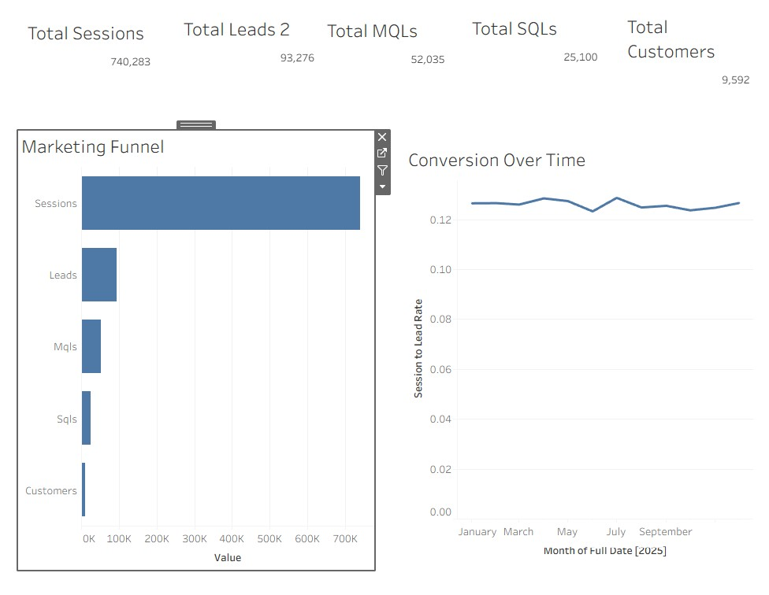
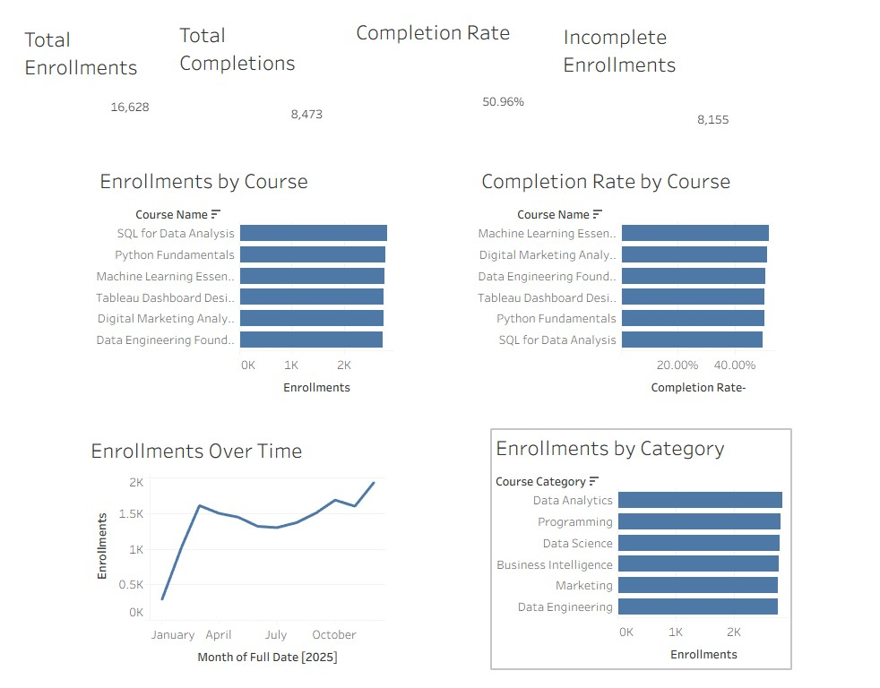

# LearnLoop Marketing Analytics Platform

**End-to-End Marketing Analytics | SQL · Tableau · Snowflake · dbt · Python · Airflow · AWS S3**

## Project Overview

**LearnLoop** is a simulated subscription-based EdTech SaaS company that sells online courses and corporate training.

Its marketing, website, CRM, subscription, and revenue data are stored across separate systems, making it difficult to understand which campaigns actually generate customers and revenue.

I built an **end-to-end marketing analytics platform** that connects:

**Ad Spend → Sessions → Leads → MQLs → SQLs → Customers → Subscriptions → Revenue**

The solution uses **Python, AWS S3, Snowflake, dbt, SQL, Airflow, and Tableau** to centralize the data, calculate business KPIs, and deliver decision-focused dashboards.

> **Goal:** help LearnLoop understand where marketing money is generating value and where budget is being wasted.

---

## Key Findings

- **$1.11M ad spend generated $373.5K in attributed revenue → 0.34x ROAS**
- **CAC = $116.08 per customer**
- **740,283 sessions → 93,276 leads → 9,592 customers**
- **Lead-to-Customer conversion ≈ 10.3%**
- **Only ~1.3% of website sessions became customers**
- **9,592 subscriptions and 16,628 course enrollments were generated**

### Main Takeaway

The biggest opportunity is not simply generating more traffic.

LearnLoop should improve **campaign efficiency and funnel conversion**, then shift more budget toward campaigns that generate stronger **ROAS, lower CAC, and higher customer value**.

---

## Recommendations

1. **Reallocate budget toward higher-ROAS campaigns**

   - Reduce spend on campaigns with weak revenue return.
   - Increase investment in campaigns with stronger ROAS and customer value.

2. **Set campaign-level ROAS and CAC targets**

   - Classify campaigns as:
     - **Scale**
     - **Optimize**
     - **Reduce**
     - **Pause**

3. **Improve funnel conversion before buying more traffic**

   - Optimize landing pages, lead forms, free trials, lead nurturing, and sales follow-up.

4. **Evaluate CAC together with CLV**

   - A campaign with higher CAC can still be valuable if it produces customers with higher lifetime value.

5. **Optimize for customers and revenue, not clicks**

   - Marketing performance should be measured across the full journey:

**Spend → Leads → Customers → Subscriptions → Revenue → CLV**

---

## Business Questions & Answers

| Business Question                           | Answer / KPI |
| ------------------------------------------- | ------------ |
| How much was invested in advertising?       | **$1.11M**   |
| How much attributed revenue was generated?  | **$373.5K**  |
| What was the overall ROAS?                  | **0.34x**    |
| What was the CAC?                           | **$116.08**  |
| How many website sessions were generated?   | **740,283**  |
| How many leads were generated?              | **93,276**   |
| How many customers were acquired?           | **9,592**    |
| What was Lead-to-Customer conversion?       | **~10.3%**   |
| What was Session-to-Customer conversion?    | **~1.3%**    |
| How many subscriptions were generated?      | **9,592**    |
| How many course enrollments were generated? | **16,628**   |

Campaign-level **ROAS, CAC, revenue and customer value**, along with **MRR, ARR, CLV, funnel performance, and course engagement**, are analyzed in the Tableau dashboards.

---

## Tableau Dashboards

### 1. Campaign Performance

**Ad Spend · Revenue · ROAS · CAC · Revenue by Campaign · ROAS by Campaign · Spend vs. Revenue · Performance Over Time**


### 2. Marketing Funnel

**Sessions → Leads → MQLs → SQLs → Customers · Conversion Rates · Funnel Drop-Off · Conversion Trends**



### 3. Subscription & Customer Value

**Subscriptions · Active Subscriptions · MRR · ARR · CLV · MRR by Plan · Customer Value by Campaign**


### 4. Course Performance

**Enrollments · Completions · Completion Rate · Enrollments by Course · Category · Performance Over Time**



---

## Data Architecture

```text
Google Ads ──────┐
Meta Ads ────────┤
GA4 ─────────────┤
HubSpot ─────────┼────► Python ETL
Stripe ──────────┤           │
Course Data ─────┘           ▼
                           AWS S3
                          Raw JSON
                             │
                             ▼
                          Snowflake
                             │
                             ▼
                             dbt
                             │
                Staging → Intermediate → Marts
                             │
                             ▼
                       Analytics / KPIs
                             │
                             ▼
                          Tableau
                             │
                             ▼
                     Business Decisions
```

**Apache Airflow** orchestrates and monitors the pipeline from data ingestion through transformation and data-quality testing.

---

## Data Model

### Dimensions

`dim_date` · `dim_customer` · `dim_campaign` · `dim_channel` · `dim_course` · `dim_subscription_plan` · `dim_device`

### Fact Tables

`fact_marketing_spend` · `fact_website_sessions` · `fact_leads` · `fact_subscriptions` · `fact_revenue` · `fact_course_enrollments`

### Analytics Models

`kpi_campaign_performance` · `kpi_funnel_performance` · `kpi_subscription_performance` · `kpi_customer_value` · `kpi_course_performance`

---

## Data Quality

Automated **dbt tests** validate:

- Null values
- Unique keys
- Referential integrity
- Model relationships
- Accepted values

---

## Technology Stack

| Area                | Technologies      |
| ------------------- | ----------------- |
| **Analysis & BI**   | SQL, Tableau      |
| **Data Warehouse**  | Snowflake         |
| **Transformation**  | dbt               |
| **Ingestion**       | Python, REST APIs |
| **Cloud Storage**   | AWS S3            |
| **Orchestration**   | Apache Airflow    |
| **Version Control** | Git, GitHub       |

---

## Repository Structure

```text
LearnLoop/
│
├── airflow/
│   └── dags/
│       └── learnloop_pipeline_dag.py
│
├── docs/
│   └── dashboards/
│       ├── campaign_performance.jpg
│       ├── course_performance.jpg
│       ├── marketing_funnel.jpg
│       └── subscription_customer_value.jpg
│
├── ingestion/
│   ├── __init__.py
│   ├── config.py
│   ├── logger.py
│   ├── run_pipeline.py
│   ├── s3_uploader.py
│   └── validator.py
│
├── learnloop_dbt/
│   ├── analyses/
│   ├── macros/
│   ├── models/
│   │   ├── staging/
│   │   ├── intermediate/
│   │   ├── marts/
│   │   └── analytics/
│   ├── seeds/
│   ├── snapshots/
│   ├── tests/
│   ├── .gitignore
│   ├── README.md
│   └── dbt_project.yml
│
├── synthetic_data/
│   └── generate_data.py
│
├── .gitignore
├── README.md
├── README_ES.md
├── learnloop_tableau_dashboards.twb
└── requirements.txt
```

---

## Skills Demonstrated

**SQL · Tableau · Marketing Analytics · Funnel Analysis · ROAS · CAC · CLV · MRR · ARR · Snowflake · dbt · Python · AWS S3 · Airflow · Dimensional Modeling · Data Quality**

---

## Project Outcome

LearnLoop transforms fragmented marketing, customer, and revenue data into a **single analytical view of the customer journey**.

> **Which marketing investments acquire customers efficiently and generate the strongest business value?**

**Business Problem → Data Integration → SQL Analysis → KPIs → Insights → Recommendations → Tableau Dashboards**

---

## Author

**Juan David Guerrero**  
**Data Analyst**

SQL · Tableau · Python · Snowflake · dbt · Marketing Analytics
